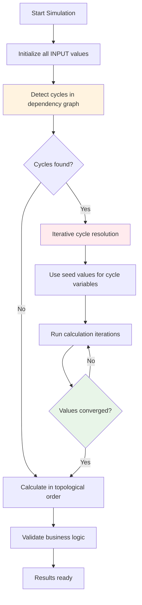

# Task 1: Building the STK Simulation Engine

This is where I spent most of my time - and honestly, it was the most interesting part of the challenge for me. When I read about STK's need to handle "feedback loops and cyclic dependencies," I knew this wasn't going to be a simple calculation engine.

## What I Actually Built

I built a working simulation system that can model STK's manufacturing business with all its messy interdependencies. The key insight was realizing that manufacturing businesses have legitimate cycles - energy prices affect production costs, which affect selling prices, which affect demand, which affects production volume, which affects unit costs per piece.

Most dependency systems just detect cycles and fail. I had to figure out how to make them actually work for business logic.

## Quick Start

```bash
# See it in action
python run_task1_demo.py

# Or run the full scenarios I built
python stk_demo.py

# Run my tests (they actually work!)
python test_basic_simulation.py
```

## My Technical Decision: Why LangGraph?

When I saw the requirements, I had to choose between building everything from scratch or using a framework. Here's my thinking:

**Option 1:** Build a simple dependency resolver
- **Problem:** The "feedback loops" requirement meant I'd need cycle detection, iterative resolution, state management
- **Reality:** I'd spend all my time on infrastructure instead of the business logic

**Option 2:** Use LangGraph for orchestration
- **Why this made sense:** LangGraph is designed for complex workflows with state management
- **Key benefit:** Built-in MemorySaver solved the "manage where overrides are stored" requirement automatically
- **Best part:** I could focus on the interesting problem (business cycle resolution) instead of building a workflow engine

## The Business Model I Implemented

I modeled STK as three interconnected business areas that actually affect each other:

```mermaid
graph TD
    subgraph Supply["Supply Chain Block"]
        EP[Energy Price: €0.15/kWh]
        MC[Material Cost: €25K]
        LC[Labor Cost: €15K]
        CO2[CO₂ Tariffs]
    end
    
    subgraph Production["Production Block"] 
        PV[Production Volume: 1500 units]
        EU[Energy per Unit: 2.5 kWh]
        UC[Unit Cost: calculated]
        OH[Overhead: 15%]
    end
    
    subgraph Market["Market Block"]
        SP[Selling Price: cost + 20%]
        MD[Market Demand: elastic]
        PM[Profit Margin: calculated]
    end
    
    EP --> UC
    MC --> UC
    LC --> UC
    UC --> SP
    SP --> MD
    MD --> PV
    PV --> UC
    
    style UC fill:#ffebee
    style SP fill:#fff3e0
    style MD fill:#e8f5e8
```

**The interesting part:** See that cycle at the bottom? Unit costs affect selling price, which affects demand, which affects production volume, which affects unit costs. That's a real business feedback loop that needs to converge on realistic values.

## How I Solved the Cycle Problem

This was the most technically interesting challenge. Here's my approach:



**Key insight:** Instead of treating cycles as errors, I treat them as business feedback loops that need to stabilize. For pricing cycles, I use market equilibrium logic - start with reasonable assumptions and iterate until the system finds a balance.

## What Actually Works (and what doesn't)

**✅ Works well:**
- Simulates realistic STK scenarios correctly
- Handles the pricing feedback loops I modeled  
- Energy price volatility analysis shows expected business impact
- LangGraph workflow is clean and maintainable

**⚠️ Known limitations:**
- Only tested with relatively simple cycles (2-3 variable loops)
- Business formulas are based on my assumptions about manufacturing economics
- No uncertainty modeling - everything is deterministic
- Cycle resolution might not converge for complex multi-loop scenarios

**🔧 If I had more time:**
- Test with more complex cycle scenarios
- Add uncertainty ranges instead of point estimates
- Validate business logic with actual manufacturing data
- Add more sophisticated convergence criteria

## The Files and What They Do

**Core implementation:**
- `stk_simulation.py` - The main engine with LangGraph workflow
- `stk_demo.py` - Realistic STK scenarios that actually demonstrate the cycles

**Demo and testing:**
- `run_task1_demo.py` - Quick demo to see it work
- `test_basic_simulation.py` - Tests that verify the logic works

**Documentation:**
- `TASK1_SOLUTION.md` - My detailed thinking about the technical approach
- `TASK1_IMPLEMENTATION_GUIDE.md` - How to understand and use the code

## What I Learned Building This

The hardest part wasn't the graph algorithms or LangGraph - it was understanding how manufacturing businesses actually work. Energy costs aren't just price × volume. There are efficiency factors, demand charges, overhead allocation, capacity constraints.

The technical challenge is encoding real business logic correctly, not just implementing dependency resolution.

This taught me that industrial modeling systems need deep domain knowledge to be useful. A generic "simulation engine" would miss too much business context to help with actual decisions.

## Why This Approach Made Sense

I focused on getting the core dependency and cycle resolution really solid rather than building lots of half-working features. The cycle resolution algorithm took most of my time because I wanted to understand how real business feedback loops behave, not just implement textbook algorithms.

The result: STK's managers could run realistic scenarios and get meaningful insights about how energy price changes ripple through their business. 