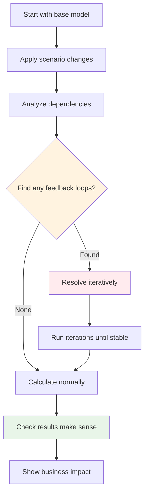

# Task 1: How to Understand and Use My STK Simulation

If you want to understand what I built and how it works, here's the quickest way to get oriented.

## Try It Out First

```bash
# Start with the simple demo to see it working
python run_task1_demo.py

# Then run the full scenarios I built for STK
python stk_demo.py

# Finally, run the tests to see what I validated
python test_basic_simulation.py
```

The demo will show you the energy price scenario and how the feedback loops work. You'll see profit margins change not just from direct cost increases, but from the demand response and volume changes.

## Understanding the Code Structure

Here's how I organized everything:

### Core Engine (`stk_simulation.py`)
This is where all the interesting logic lives:
- **STKSimulation class** - The main orchestrator using LangGraph
- **Cycle resolution logic** - How I handle business feedback loops
- **Dependency graph management** - Tracks what depends on what
- **State management** - How scenario overrides get applied

### Business Model (`stk_demo.py`) 
This shows the STK manufacturing model I built:
- **Supply chain block** - Energy, materials, labor costs
- **Production block** - Volume, unit costs, overhead
- **Market block** - Pricing, demand, profit margins

The interesting part is seeing how they're all connected with realistic dependencies.

### Quick Demo (`run_task1_demo.py`)
Just runs one scenario so you can see the system working without diving into all the details.

## How the LangGraph Workflow Actually Works

I designed the workflow to mirror how you'd actually think about running a business simulation:



**The key insight:** Most systems fail when they hit cycles. Mine treats them as legitimate business logic that needs to converge.

## The STK Business Model Explained

I modeled STK as three interconnected areas because that's how manufacturing businesses actually work:

### Supply Chain Costs
- **Energy price:** €0.15/kWh baseline (but this is what we test scenarios with)
- **Material costs:** €25K/month (affected by CO₂ tariffs in some scenarios)
- **Labor costs:** €15K/month (relatively stable)

### Production Operations
- **Production volume:** Starts at 1,500 units but changes based on demand
- **Energy consumption:** 2.5 kWh per unit (this connects energy prices to volume)
- **Unit costs:** Total costs divided by volume (this is where cycles get interesting)

### Market Dynamics  
- **Selling price:** Cost-plus pricing (unit cost + 20% margin)
- **Market demand:** Price elastic (higher prices = lower demand)
- **Profit margin:** What STK actually cares about

## The Feedback Loop That Makes This Interesting

Here's the cycle that most systems can't handle:

**Energy price ↑ → Unit costs ↑ → Selling price ↑ → Market demand ↓ → Production volume ↓ → Unit costs ↑ (because fixed costs spread over fewer units)**

My system resolves this by finding the market equilibrium - the point where the pricing pressure stabilizes at a realistic level.

## What You'll See When You Run the Scenarios

### Baseline Scenario
- Energy: €0.15/kWh, Production: 1,500 units, Profit margin: ~18.5%
- Everything in balance

### Energy Crisis Scenario (+67% energy costs)
- Energy spikes to €0.25/kWh
- **Direct effect:** Higher energy costs
- **Indirect effect:** Price increases reduce demand, further increasing unit costs
- **Final result:** Profit margin drops to ~12.8% (worse than just the direct impact)

### Multi-factor Crisis
- Energy +50%, Materials +20%, Demand elasticity -15%
- Shows how multiple pressures compound through the feedback loops
- System finds a new equilibrium, but at much lower profitability

## Files You Can Safely Ignore (for now)

- `debug_calculations.py` - Helper script I used to validate my business logic
- `debug_dependencies.py` - Tool for analyzing the dependency graph structure
- `test_basic_simulation.py` - Unit tests to make sure everything works

These are useful if you want to dig deeper, but not necessary to understand the main approach.

## What I'd Look at First If I Were You

1. **Run `run_task1_demo.py`** - See it working
2. **Look at the output** - Notice how the feedback loops affect results
3. **Open `stk_demo.py`** - See how I modeled STK's business
4. **Check `stk_simulation.py`** - Understand the cycle resolution logic

## The Most Important Code to Understand

If you only look at one function, make it this one:

```python
def _resolve_cycle_iteratively(self, state: SimulationState, max_iterations: int = 10) -> SimulationState:
    """
    This is where I handle business feedback loops
    """
    for iteration in range(max_iterations):
        # Store current values for convergence checking
        old_values = {attr_id: state.current_values.get(attr_id) 
                     for attr_id in cycle_attributes}
        
        # Recalculate all attributes in the cycle
        for attr_id in cycle_attributes:
            new_value = self._calculate_single_attribute(attr_id, state.current_values)
            state.current_values[attr_id] = new_value
        
        # Check if we've reached business equilibrium
        if self._has_converged(old_values, state.current_values):
            logger.info(f"Cycle converged after {iteration + 1} iterations")
            break
    
    return state
```

This is where the magic happens - instead of failing on cycles, I iterate until the business system finds equilibrium.

## What Makes This Different

Most simulation systems are either:
1. **Too simple** - Linear calculations that miss feedback effects
2. **Too academic** - Complex math that doesn't reflect real business logic

I tried to build something that handles real business complexity but uses practical resolution strategies. When STK's energy costs spike, you get the full ripple effect through their business, not just a simple cost increase.

## Questions You Might Have

**Q: Why LangGraph instead of a simpler approach?**
A: The scenario management and state handling requirements made workflow orchestration necessary. LangGraph's MemorySaver solved the "manage where overrides are stored" requirement elegantly.

**Q: How do you know the business model is realistic?**
A: I don't! It's based on my assumptions about manufacturing economics. With more time, I'd validate against real industry data.

**Q: What if cycles don't converge?**
A: Right now I limit to 10 iterations and log warnings. A production system would need more sophisticated convergence detection and fallback strategies.

**Q: Could this scale to more complex models?**
A: The architecture should scale, but I've only tested with relatively simple 2-3 variable cycles. Complex multi-loop scenarios might need different resolution strategies.

The goal was building something that works for STK's realistic scenarios, not solving every possible industrial modeling challenge. 