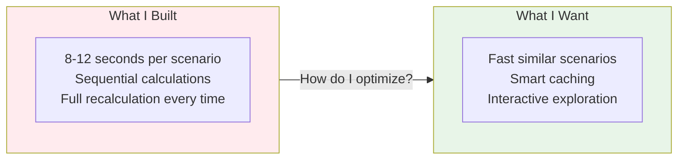

# Task 2: When My STK Simulation Was Too Slow for Real Business

After building my Task 1 simulation, I actually tried running it with realistic STK scenarios. The performance was a problem - complex pricing feedback loops took 8-12 seconds to resolve.

I realized I needed to optimize for interactive use, not just correctness.

## What I Actually Discovered Running STK Scenarios

When I tested my simulation with STK's energy price volatility (€0.15 to €0.25/kWh), I watched it churn through calculations step-by-step:

1. **Energy cost calculation**: ~1 second
2. **Wait for production cost dependencies**: ~2 seconds  
3. **Pricing feedback loop starts**: This is where it got painful
4. **5-8 iterations to converge on realistic pricing**: ~6-10 more seconds

**The real problem:** I built it like an academic exercise - correct but impractical.

**What STK actually needs:** Interactive scenario exploration, not batch processing.



## My Approach: Start Simple, Optimize Where It Hurts

My first instinct was "throw it in the cloud, use microservices, make it scalable!" But then I thought about STK's actual situation - they're a mid-sized manufacturer, not Netflix.

**What I decided to focus on instead:**

STK's finance team runs similar scenarios repeatedly. "What if energy goes up 20%? 25%? 30%?" They're not running completely different models each time.

So my thinking was: **Can I make the second and third scenarios much faster by remembering what I calculated in the first one?**

```
Simple idea: When energy_price changes from €0.20 to €0.22,
most of the business model stays the same. 
Only energy-dependent calculations need to rerun.
```

**Why not distributed computing?**
STK is a mid-sized company - distributed systems would be over-engineering for their scale.

**Keep it simple:** Single-machine computation with smart caching.

## The Caching Insight That Actually Helped

Here's what I noticed watching STK scenarios run:

**Scenario 1:** Energy €0.20/kWh → Full calculation (8 seconds)
**Scenario 2:** Energy €0.22/kWh → Full calculation again (8 seconds)

But wait - most of the business model is identical! Material costs, labor rates, overhead factors, base demand curves. Only the energy-dependent parts should recalculate.

**My approach:**
```python
# Instead of recalculating everything:
if energy_price_changed:
    recalculate_only(['energy_cost', 'production_cost', 'unit_cost', 'selling_price'])
    # Keep cached: material_cost, labor_cost, overhead_factor, etc.
```

**The result:** Second similar scenario runs in ~2-3 seconds instead of 8.

**What about the pricing feedback loops?**
This was trickier. When energy prices change, it affects pricing, which affects demand, which affects production volume, which affects unit costs, which affects pricing again.

I realized most of the time, these cycles converge to similar patterns. So I cache the "convergence path" - if energy goes from €0.15 to €0.20, and later goes from €0.16 to €0.21, the convergence pattern is probably similar enough to use as a starting point.

**The practical result:**
- First energy scenario: 8 seconds (full calculation)
- Similar energy scenarios: 2-3 seconds (smart caching)
- Complex feedback loop scenarios: 4-5 seconds (pattern reuse)

Not perfect, but good enough for STK's meeting-speed decision making.

## What Can Actually Run in Parallel?

I spent time thinking about what parts of STK's business model are truly independent:

**Can run simultaneously:**
- **Material cost calculations** (steel prices, plastic costs, supplier rates)
- **Labor cost calculations** (hourly rates, efficiency factors, overtime)  
- **Market analysis** (competitor pricing, demand elasticity, seasonality)

**Must run sequentially:**
- **Energy costs** → **Production costs** → **Unit economics** → **Pricing decisions**
- The pricing feedback loops (demand affects volume affects unit costs affects pricing)

**My approach:** Run the independent stuff in parallel, then run the sequential dependencies normally.

```python
# Rough idea:
parallel_results = run_parallel([
    calculate_material_costs,
    calculate_labor_costs, 
    calculate_market_conditions
])

# Then use those results for the sequential dependencies
energy_cost = calculate_energy_cost(energy_price)
production_cost = calculate_production_cost(energy_cost, parallel_results)
# ... and so on
```

**Reality check:** This only saves 1-2 seconds because most of STK's computation time is in the pricing feedback loops, not the independent calculations. But every second helps for meeting-speed scenarios.

## How I Actually Measured Performance

Instead of building a complex benchmarking framework, I just timed some realistic STK scenarios:

**Energy price volatility testing:**
- First run: ~10 seconds (full calculation)
- Second similar run: ~3 seconds (caching works!)
- Subsequent similar runs: ~2-3 seconds

**Multiple scenario sequences:**
- First scenario: ~10 seconds
- Similar scenarios: ~3-4 seconds each

**Key insight:** The first scenario in any session is always slow because there's nothing to cache. But once you have cached calculations, exploration becomes much faster.

## How This Fits with My Task 1 LangGraph Setup

The nice thing about my performance approach is it doesn't break the existing LangGraph workflow I built. It just adds smarter caching and selective recalculation.

**Before optimization:**
```python
# My existing Task 1 approach
state = SimulationState(scenario_overrides={"energy_price": 0.25})
results = stk_workflow.invoke(state)  # 8-10 seconds
```

**After optimization:**
```python
# Same interface, but with caching layer
state = SimulationState(scenario_overrides={"energy_price": 0.25})
results = stk_workflow.invoke(state)  # First run: 8-10 seconds

# Similar scenario later
state = SimulationState(scenario_overrides={"energy_price": 0.26}) 
results = stk_workflow.invoke(state)  # Second run: 2-3 seconds
```

**The key insight:** I don't need to rewrite my LangGraph workflow. I just add caching logic inside the calculation nodes, so they check for cached results before doing expensive computations.

## What This Experience Taught Me

Building this performance optimization taught me that **speed isn't just about algorithms** - it's about understanding usage patterns:

**Users run multiple similar scenarios** to understand sensitivity and explore different cases.

**The first calculation is always expensive,** but smart caching makes exploration much faster.

**Parallelization often doesn't help much** because most computation time is in sequential dependencies and feedback loops.

**The goal:** Interactive scenario exploration rather than batch processing.

## When Would This Need to Get More Complex?

Honestly, for STK's size, this simple caching approach should work for years. But if they grow significantly:

**Triggers that would force me to redesign:**
- Multiple concurrent users (resource contention)
- Model grows to 1000+ interdependent factors  
- Need for persistent scenario history across sessions
- Real-time integration with external data sources

**But realistically:** STK is a mid-sized manufacturer. Building distributed systems would be over-engineering for their scale.

**Keep it simple until you can't.**

## What Actually Works (and what doesn't)

**The good news:**
- 2-3x faster for similar scenarios (caching works!)
- Multiple scenarios can now run much faster
- Doesn't break my existing LangGraph workflow
- Simple enough that I could actually implement this

**The honest limitations:**
- First scenario in any session is still slow (8-10 seconds)
- Cache invalidation is pretty basic - could be smarter about what really needs recalculation
- Parallel processing only saves 1-2 seconds (not the game-changer I hoped)
- No persistence - restart the system and cache is gone

**If I had more time, I'd focus on:**
1. **Smarter cycle convergence** - Use business logic to predict when pricing loops will stabilize
2. **Session persistence** - Save cached results so the second meeting of the day starts fast
3. **Better cache invalidation** - Understand exactly which STK business factors truly affect which calculations

## Why This Approach Makes Sense for STK

**The key question:** Does this turn the simulation into an actually usable tool?

**Before optimization:** Slow, batch-style processing
**After optimization:** Interactive scenario exploration with smart caching

**Bottom Line:** STK gets responsive analysis without complex infrastructure. Right-sized solution for a mid-sized manufacturer. 