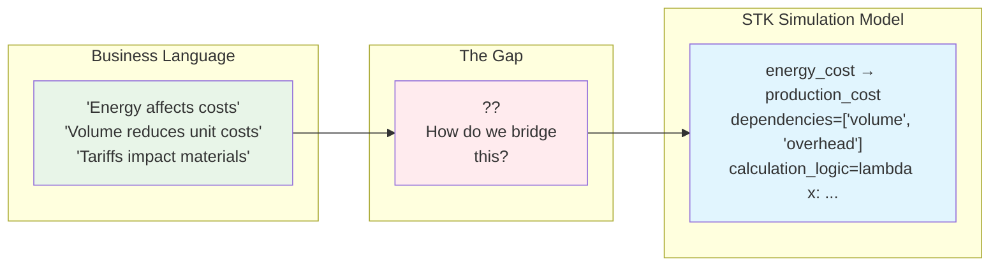
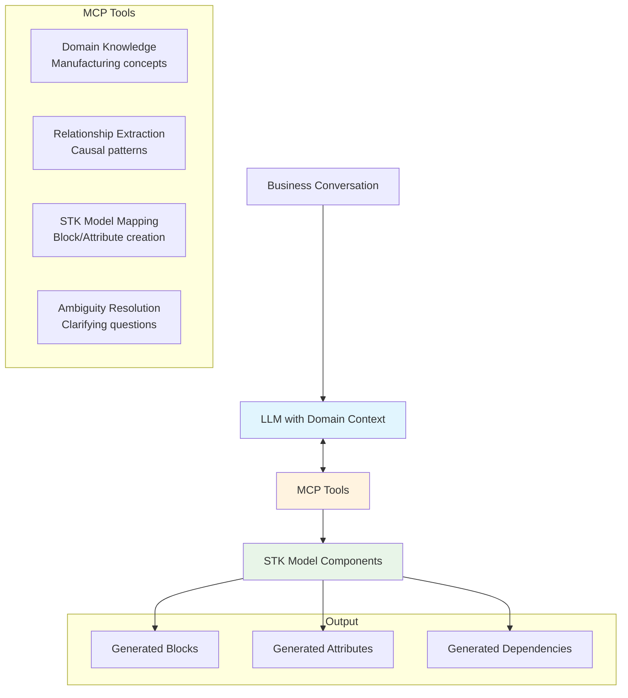
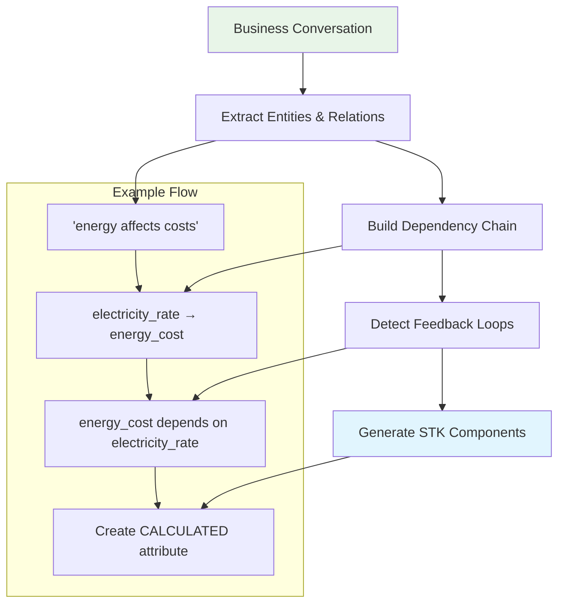

# Task 3: Getting Natural Language Into STK Models

Since I couldn't implement everything, I focused my remaining time on thinking through how I'd tackle the natural language challenge. This was actually the most intriguing part for me - how do you go from a business conversation to a working simulation model?

## The Real Problem

When I read "Design an approach to extract knowledge from text or dialogue," I realized this isn't just an NLP problem. It's about bridging two very different ways of thinking:

**How STK stakeholders actually talk:**
- "When energy prices spike, our margins get squeezed"  
- "Higher production volumes should reduce our unit costs"
- "The new CO₂ tariffs hit us directly on imported materials"

**What my simulation needs:**
- Specific attribute dependencies (energy_cost → production_cost)
- Quantitative relationships (20% energy increase = X% cost impact)  
- Mathematical formulas that actually work

The gap between these is huge.



## My Approach: MCP + Domain Intelligence

After researching current approaches, I settled on using **Model Context Protocol (MCP)** - it's specifically designed for this kind of LLM-to-external-system integration, and it's getting traction in 2025.

### Why MCP over other approaches?

**Alternative 1:** Fine-tune a model on manufacturing data
- **Problem:** I don't have enough domain-specific training data, and manufacturing terminology is very context-dependent

**Alternative 2:** Pure prompt engineering  
- **Problem:** Too brittle. "Energy affects costs" could mean 50 different things

**Alternative 3:** Traditional NLP pipeline (NER → relation extraction → mapping)
- **Problem:** Misses the contextual reasoning. "Higher volume reduces unit costs" requires understanding of manufacturing economics

**My MCP approach:** One LLM with specialized tools that understand STK's business domain.

### The Architecture I'd Build



## Concrete Example: Energy Cost Conversation

**Input conversation:**
```
"Our energy costs have been volatile. A 20% increase in electricity prices 
directly raises our production expenses, forcing us to adjust selling prices. 
This pricing change affects market demand, which then influences our 
production planning."
```

**What I'd extract:**

**Step 1 - Entity Recognition:**
- energy_costs, electricity_prices, production_expenses, selling_prices, market_demand, production_planning

**Step 2 - Relationship Mapping:**
- electricity_prices → production_expenses (direct, quantified: 20% increase)
- production_expenses → selling_prices (causal, cost-plus pricing)  
- selling_prices → market_demand (inverse relationship, price elasticity)
- market_demand → production_planning (capacity constraint)

**Step 3 - STK Model Generation:**
```python
# What gets created automatically
supply_block = Block("supply_chain", "Supply Chain Management")
supply_block.add_attribute(Attribute(
    "electricity_rate", "Electricity Rate (€/kWh)", 
    AttributeType.INPUT, 0.15
))

production_block = Block("production", "Production Operations") 
production_block.add_attribute(Attribute(
    "energy_cost", "Energy Cost (€)",
    AttributeType.CALCULATED,
    dependencies=["electricity_rate", "production_volume"],
    calculation_logic=lambda deps: deps["electricity_rate"] * deps["production_volume"] * 2.5
))
```

Here's how I visualize the extraction process:



## The Hard Parts I'd Need to Solve

### 1. Quantification Ambiguity
**Problem:** "Energy prices directly affect production costs"  
**Need to resolve:** By what factor? Linear? With thresholds?

**My approach:** Use domain knowledge + clarifying questions
- "When you say 'directly affect' - is this a 1:1 relationship or are there efficiency factors?"
- "Have you observed this relationship historically? What's the typical impact ratio?"

### 2. Missing Context
**Problem:** "When prices exceed €60/unit, demand drops significantly"
**Missing:** What's the baseline demand? How much is "significantly"?

**My approach:** Inference + validation
- Use typical manufacturing patterns to infer reasonable defaults
- Present assumptions back to user for validation
- Build confidence scores into the model

### 3. Feedback Loop Recognition  
**Problem:** "Higher selling prices reduce demand, which affects production volume, which increases unit costs"
**Challenge:** This creates a cycle that needs special handling

**My approach:** 
- Detect the cycle pattern during relationship extraction
- Explain the feedback loop in business terms
- Use the same iterative resolution I built for Task 1

## What I'd Actually Implement

If I had more time, here's the order I'd tackle this:

### Phase 1: Simple Extraction (2-3 days)
Basic MCP tool that can parse straightforward relationships like "X affects Y" and map them to attribute dependencies.

### Phase 2: Quantification (1 week)  
Add logic to extract or infer numerical relationships. Handle phrases like "20% increase" or "significantly impacts."

### Phase 3: Business Logic (2 weeks)
Encode manufacturing domain knowledge so the system understands context like "unit costs," "overhead allocation," "capacity constraints."

### Phase 4: Interactive Refinement (1 week)
Build the clarifying question system so users can iteratively improve the extracted model.

## Integration with My Task 1 Implementation

The beautiful part is this would feed directly into my existing STK simulation:

```python
# Natural language processing generates this
extracted_model = nlp_processor.process(business_conversation)

# Direct integration with existing Task 1 code  
stk_simulation = STKSimulation("extracted_model")
for block_data in extracted_model.blocks:
    # My existing Block/Attribute classes handle this automatically
    stk_simulation.add_block(block_data)

# Same LangGraph workflow handles execution
results = stk_simulation.run_simulation()
```

## Why This Matters for STK

The real value isn't just converting text to models - it's **capturing institutional knowledge**. STK's experienced managers understand the business interdependencies intuitively. This approach would let them contribute that knowledge without having to learn technical modeling.

**Example use cases:**
- New regulation discussion → automatic impact model
- Production planning meeting → capacity constraint updates  
- Market analysis conversation → demand elasticity adjustments

## Validation Strategy

How would I know if this actually works?

1. **Start with my own Task 1 model** - Can I extract the same relationships I manually coded?
2. **Test with manufacturing case studies** - Use published examples to validate domain logic
3. **Iterative refinement with domain experts** - Get actual manufacturing folks to test the extraction quality

The goal isn't perfection on day one - it's building a system that gets better as it learns more about STK's specific business context.

## What I Learned Thinking This Through

The technical NLP parts aren't the hardest challenge - it's the domain knowledge encoding. Understanding that "unit costs decrease with volume" requires knowledge about fixed vs. variable costs, capacity utilization, overhead allocation methods.

This reinforced my belief that these AI systems need to be domain-specific to be truly useful. A generic "text-to-model" system would miss too much business context to be practical for something like STK's manufacturing decisions. 