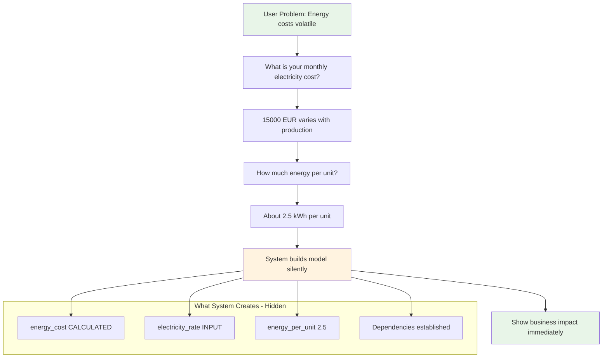
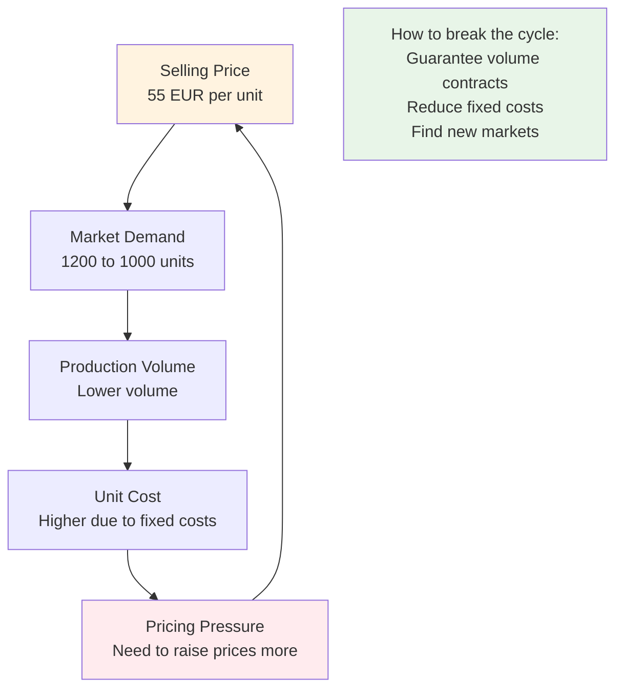
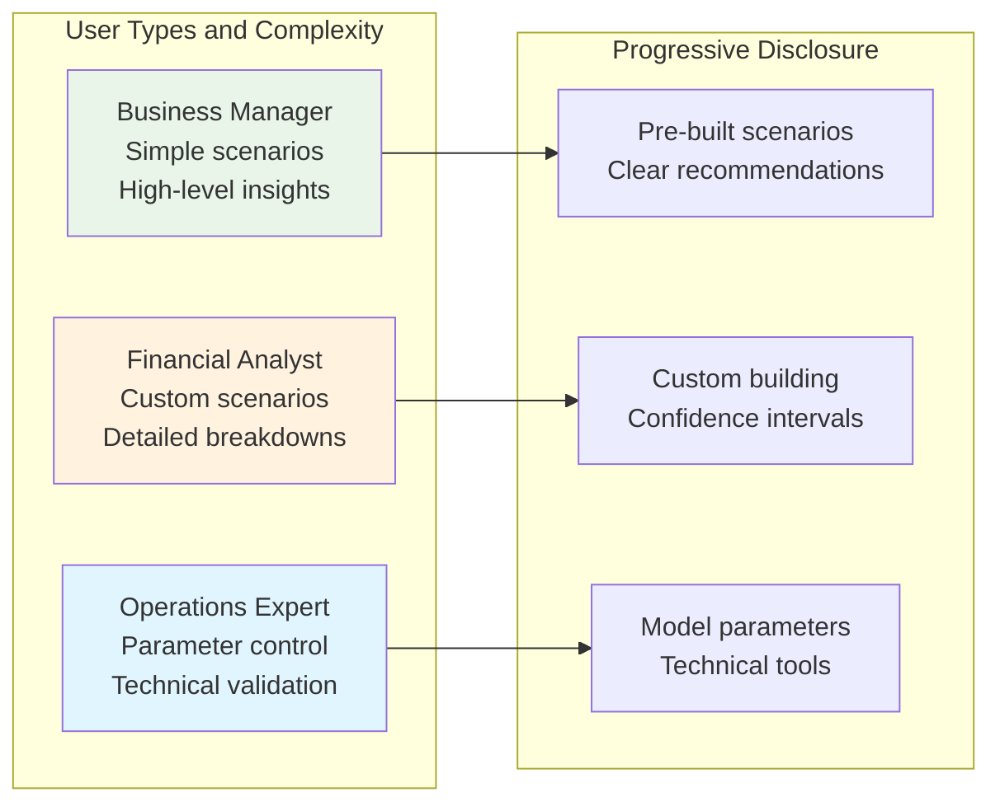

# Task 4: Making This Actually Usable for Business People

When I read "design the interface for non-technical users," my first thought was: most business interfaces for complex systems are terrible. They either oversimplify to the point of being useless, or they expose every technical detail and overwhelm people.

STK's managers need to understand how energy prices affect their margins, but they shouldn't have to learn what a "dependency graph" is.

## The Core UX Challenge

**The technical reality:** STK's simulation has Blocks, Attributes, Dependencies, Cycles, Override Management, LangGraph Workflows...

**What a business user actually wants:** "If energy prices go up 30%, what happens to my profits?"

The gap between these is the design challenge.

## My Philosophy: Start With Business Questions

Instead of asking users to "create a model," start with problems they're already thinking about:

```mermaid
graph TD
    subgraph TechnicalFirst["Bad UX - Technical First"]
        T1[Create new simulation] --> T2[Add blocks]
        T2 --> T3[Define attributes]
        T3 --> T4[Set dependencies]
        T4 --> T5[Configure overrides]
        T5 --> T6[Run simulation]
    end
    
    subgraph BusinessFirst["Better UX - Business First"]
        B1[What keeps you up at night?] --> B2[Energy costs are killing us]
        B2 --> B3[Let's model that...]
        B3 --> B4[System builds model behind scenes]
        B4 --> B5[Here's what happens if energy prices spike 30%...]
    end
    
    style T1 fill:#ffebee
    style T6 fill:#ffebee
    style B1 fill:#e8f5e8
    style B5 fill:#e8f5e8
```



## The Interface I'd Design

### Starting Point: Business Problems, Not Technical Features

Instead of a dashboard full of buttons, start with familiar concerns:

```
Welcome to STK Decision Support

What business challenge would you like to explore?

[💰 Profit margins under pressure]
[⚡ Energy costs volatile] 
[📊 Production planning unclear]  
[🌍 Regulatory changes impact]
[💬 Tell me about something else...]
```

Each option leads to a guided conversation that builds the model without the user knowing it.

### Example: Energy Impact Assessment

**User clicks "Energy costs volatile"**

**System:** "I can help you understand energy price impact on your business. What's your typical monthly electricity cost?"

**User:** "Around €15,000, but it varies a lot with production volume."

**System:** "That makes sense - more production means more energy use. Do you know roughly how much energy each unit requires?"

**User:** "Our estimate is about 2.5 kWh per unit."

**Behind the scenes:** The system just created:
- Energy cost attribute (CALCULATED)  
- Production volume dependency
- Energy rate input (€0.15/kWh implied from €15K/month)
- Energy per unit factor (2.5 kWh)

**User never sees this technical structure.**

Here's how this conversation flow works:



### Real-Time Business Impact Communication

Instead of showing raw numbers, translate everything into business language:

**Technical output (hidden):**
```
production_cost: €44,500
energy_cost: €3,750  
selling_price: €55.20
profit_margin: 15.2%
```

**Business communication (what user sees):**
```
📊 Energy price increase of 30% would:
💰 Drop your profit margin from 18.5% to 15.2%
📈 Cost you about €12,400 per month
⚠️ Risk level: Medium - consider hedging options

🎯 Recommended actions:
• Lock in energy contracts for 6 months
• Increase prices by €3/unit (+5.5%)  
• Invest in energy efficiency improvements
```

## Handling the Complex Stuff (Like Cycles)

When my Task 1 system detects feedback loops, most users won't understand "cycle detected in dependency graph." Instead:

**Technical reality:** pricing → demand → volume → unit_cost → pricing (cycle)

**Business explanation:**
```
"I notice this creates a pricing feedback loop:

Higher prices → Lower demand → Higher unit costs → More pricing pressure

This is common in manufacturing. Here are three ways to handle it:
• Accept the pricing pressure (current scenario)
• Find ways to guarantee volume (contracts, new markets)  
• Reduce fixed costs to break the cycle

Which approach interests you?"
```

Here's how I'd visualize this feedback loop for business users:



## My Approach to Scenario Planning

Instead of "parameter overrides," use business-relevant scenario templates:

```
Scenario Dashboard

Energy Risks:
[📈 Energy prices spike 30%] → Your profit drops to 13.2%
[⚡ Power supply disruption] → Production capacity at 60%  
[🌱 Green energy requirements] → Compliance costs +€8K/month

Market Risks:  
[📉 Demand drops 25%] → Excess capacity costs €45K/month
[💰 Competitors cut prices] → Margin pressure, volume opportunity
[🌍 New market opportunity] → Scale-up investment analysis
```

Each scenario is preconfigured based on real business situations. Users can run them immediately or customize the parameters.

## Interactive Controls That Make Sense

Business people understand sliders and "what-if" controls:

```
Energy Price Impact Analysis
                    
Current: €0.15/kWh  ←→ [slider] ←→ Crisis: €0.25/kWh

Live Impact:
Profit Margin: 18.5% → 12.8% ⚠️
Monthly Loss: €0 → €18,400
Break-even: 1,150 units → 1,420 units

[Alert: Break-even above normal capacity]
```

The user can instantly see how sensitive their business is to energy price changes.

## Progressive Disclosure

Not everyone needs the same level of detail:

**Business Manager (simple):**
- Pre-built scenarios
- High-level impact summaries  
- Clear recommendations

**Financial Analyst (moderate):**
- Custom scenario building
- Detailed cost breakdowns
- Confidence intervals

**Operations Expert (detailed):**
- Model parameter adjustment
- Technical validation tools
- Advanced "what-if" modeling

The interface adapts based on user role and comfort level.



## Error Prevention Through Business Logic

Instead of technical validation errors, use business sense checks:

**Bad:** "Invalid parameter range detected"
**Better:** "A €200/unit selling price seems high for your industry. Would you like to double-check that?"

**Bad:** "Cycle detected in dependency graph"  
**Better:** "I notice this creates a business feedback loop that might make your projections unstable. Let me help you handle that."

## What I Learned Designing This

The hardest part isn't the technical implementation - it's understanding how business people actually think about their problems. They don't start with models; they start with concerns.

**Key insights:**
1. **Lead with pain points, not features** - "Energy costs hurt" not "Create simulation"
2. **Use progressive revelation** - Show complexity only when needed
3. **Translate everything** - Technical accuracy with business language
4. **Make uncertainty clear** - Business people understand risk; they don't understand confidence intervals
5. **Provide actionable next steps** - Don't just show problems, suggest solutions

## Integration with My Task 1 Implementation

The beautiful part is this interface would sit on top of my existing simulation engine:

```python
# User conversation generates this behind the scenes
user_scenario = {
    "energy_price_override": 0.25,  # 30% increase
    "concern": "profit_impact",
    "user_type": "business_manager"
}

# Same STK simulation runs
results = stk_simulation.run_simulation(scenario_overrides=user_scenario)

# But results get translated for business consumption
business_summary = translate_for_business_user(results, user_scenario)
```

## Validation Strategy

How would I know if this interface actually works?

1. **Task completion rate** - Can business users successfully run scenarios?
2. **Time to insight** - How quickly do they get actionable information?
3. **Return usage** - Do they come back and use it regularly?
4. **Decision quality** - Do the insights actually help with business decisions?

Most importantly: **Get real business users to test it.** Not developers, not designers - actual managers who need to make these decisions.

## What I'd Build First

If I had limited time:

1. **Conversational scenario setup** - The guided questioning to build models
2. **Business impact translation** - Convert technical results to business language  
3. **Pre-built scenario templates** - Energy crisis, demand shifts, regulatory changes
4. **Simple sensitivity controls** - Sliders for key variables

The goal is getting business value quickly, then adding sophistication based on actual usage patterns.

## Why This Matters for STK

The real test of any decision support system is: do people actually use it to make decisions? 

STK's managers already understand their business intuitively. This interface should amplify that understanding, not replace it with technical complexity. When energy prices spike, they need to quickly understand the impact and evaluate their options - not learn how to operate a simulation system.

If successful, this becomes part of how STK thinks about their business, not just a tool they occasionally use. 